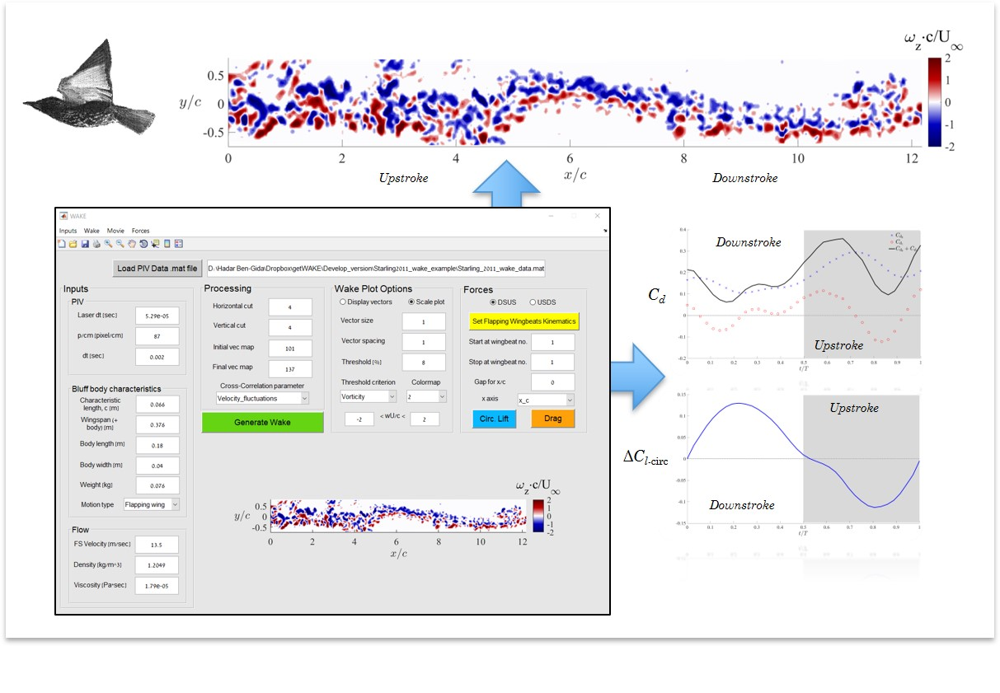

getWAKE Toolbox
+++++++++++++++++++++++++++++++++++++++++++++++++

What is it?
------------

+ getWAKE (v1.7) is a collection of Matlab subroutines and GUI for post-processing of bluff-bodies wake data measured using Particle Image Velocimetry (PIV), and analyzed by OpenPIV (or other) software. 

+ getWAKE accepts PIV wake data as .mat files extracted from the OpenPIV-spatial-analysis-toolbox. Future version of the code will also support .vec files. 

+ getWAKE allows the user to re-construct a full unsteady wake image from a set of PIV images recorded behind bluff-bodies using a cross-correlation algorithm, which overlaps consecutive images. 

+ getWAKE allows the estimation of drag and cumulative circulatory lift forces from the wake data, thus enabling the user to estimate the loads exerted on the body generating the wake.

How to cite this work?
------------

Ben-Gida, Hadar; Gurka, Roi; Liberzon, Alex (2020): OpenPIV - getWAKE Matlab Toolbox. figshare. Software. https://figshare.com/articles/OpenPIV_-_WAKE-GUI_Matlab_ToolBox/12331007. DOI 10.6084/m9.figshare.12331007

User's Manual
------------
https://github.com/bengida1989/getWAKE/blob/master/%E2%80%8F%E2%80%8FgetWAKE-UsersManual.pdf
  

Support
------------

+ Please note that the current getWAKE version (1.6) supports Matlab 2015a-2020a versions.

+ source code for the project is maintained at
  `<https://github.com/OpenPIV/getWAKE>`_
  `<https://github.com/bengida1989/getWAKE>`_
  
+ to modify these pages:

  - git clone https://github.com/OpenPIV/getWAKE.git
  - git clone https://github.com/bengida1989/getWAKE.git
 
  - from Matlab shell run::

      >> WAKE 

Developer
++++++++++

Dr. Hadar Ben-Gida
